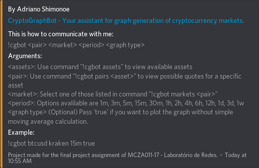
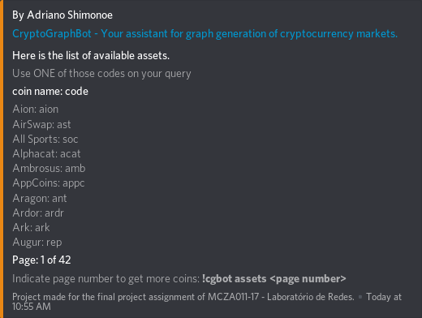
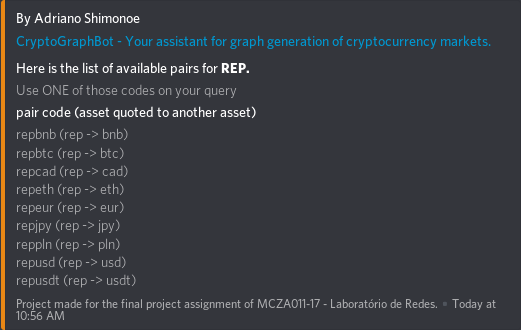
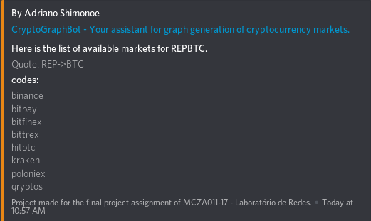
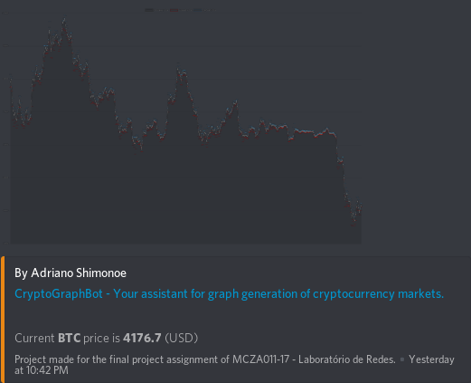
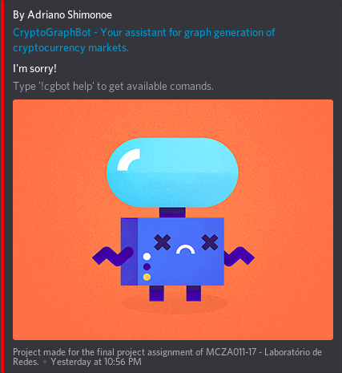

# CryptoGraphBot


A Chatbot for Discord to get cryptocurrency graphs. :graph:


## Features

- Support multiple assets options for quotes.

- Supports calls for defined periods of time.

- Supports simple moving average (sma) as option on chart generation.

- Gets the current price of an asset.

- List the pairs of an asset.

## Installation and configuration instructions

Assuming that you already installed [Node.js and npm](https://nodejs.org/), clone this repository using:

`git clone https://github.com/shimonoe/CryptoGraphBot.git`

Also, you nedd to install cairo. Follow instructions on this [link](https://www.cairographics.org/download/).

Enter repository folder and install dependencies:

`cd CryptoGraphBot | npm i`

Create the config folder inside the src folder:

`mkdir src/config`

Then, create the config file as:

`touch src/config/auth.json`

Now, you need to get your bot token. If you haven't created yet, do it [here](http://discordapp.com/developers/applications/me). Copy the token and paste inside the *src/config/auth.config* file this code:

```json
{
    "token": "<PASTE YOUR TOKEN HERE>"
}
```

Remember, this bot needs to be added to a server before starting the script. Copy your bot client id, replace it on this url and open in your browser:

`https://discordapp.com/oauth2/authorize?client_id=<Bot_Client_ID>&scope=bot&permissions=0`

### Start bot

On root folder of this project, use this command to start the bot:

`npm run prod`

You will get a message saying *Logged in as CryptoGraphBot#NUMBER*. Congratulations! Now its ready to use!

## How to use

Its easy to get the bot available commands. Type

- `!cgbot help`  to get all available commands inside discord chat.

- `!cgbot assets` to get the list of valid assets for quote.

- `!cbot pairs <asset>` to get all pairs of an specific asset.

- `!cgbot markets <pair>` to get the markets that offer this pair of assets.

- `!cgbot period` to show the list of periods available to use.

- `!cgbot <asset> <market> <period> <(true/false) Optional>` to plot the graph of an asset on a market.

Here are some screen captures of CryptoGraphBot response messages:

On **!cgbot help**:




On **!cgbot assets**:



On **!cgbot pairs rep**:



On **!cgbot markets repbtc**:



On **!cgbot btcusd kraken 12h**:



On **!cgbot dasdasdas (invalid options)**:


